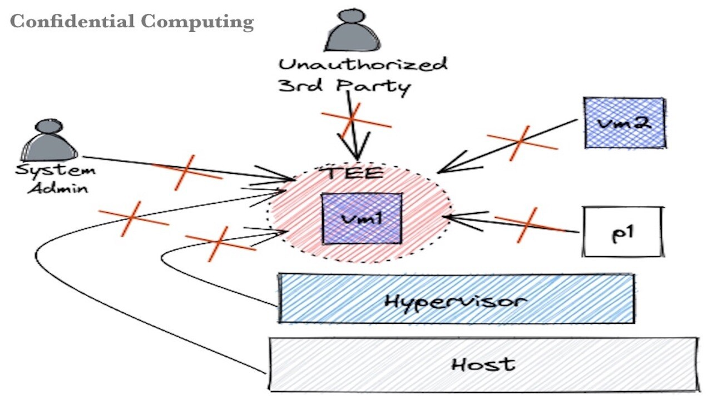
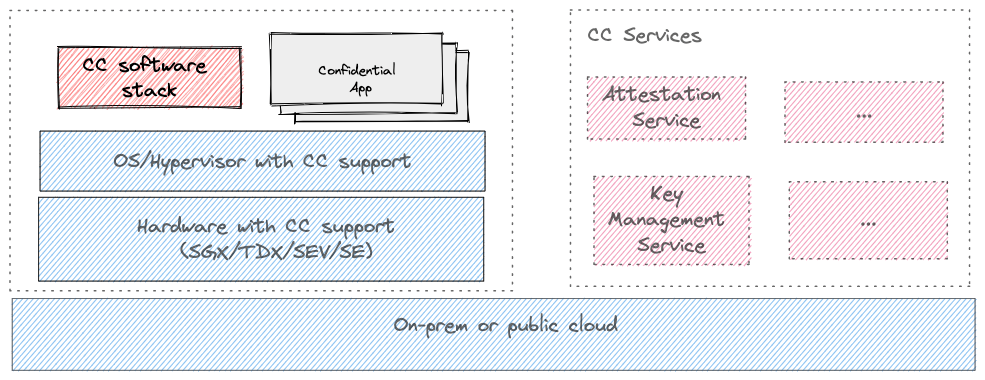

# Awesome Confidential Computing

Collection of materials to help with the understanding of this fascinating technology.

## Big Picture

Confidential computing protects your workload from unauthorised entities — the host or hypervisor, system administrators, service providers, other VMs, and processes on the host.

A Trusted Execution Environment (TEE) is at the heart of a confidential computing solution. TEEs are secure and isolated environments provided by confidential computing (CC) enabled hardware that prevents unauthorised access or modification of applications and data while in use

The following diagram provides a logical view of confidential computing solution. This can be used as a mental model to have a better understanding of the technology.

Source: [Understanding a confidential computing solution](https://bit.ly/cc-solution)

## Overview
* [Confidential Computing Overview and Use cases](https://confidentialcomputing.io/wp-content/uploads/sites/85/2021/03/confidentialcomputing_outreach_whitepaper-8-5x11-1.pdf)
* [Process based and VM based TEEs](https://next.redhat.com/2019/12/02/current-trusted-execution-environment-landscape/)

## Hardware with CC support

* [AMD SEV](https://developer.amd.com/sev/)
* [ARM TrustZone](https://www.arm.com/technologies/trustzone-for-cortex-a)
* [IBM Secure Execution](https://www.ibm.com/docs/en/linux-on-systems?topic=linux-components)
* [IBM PEF](https://developer.ibm.com/articles/l-support-protected-computing/)
* [Intel SGX](https://www.intel.in/content/www/in/en/architecture-and-technology/software-guard-extensions.html)
* [Intel TDX](https://www.intel.com/content/www/us/en/developer/articles/technical/intel-trust-domain-extensions.html)

## Operating System with CC support

* [Linux support - SEV](https://dri.freedesktop.org/docs/drm/virt/kvm/x86/amd-memory-encryption.html)
* [Linux support - SGX](https://dri.freedesktop.org/docs/drm/x86/sgx.html?highlight=sgx)
* [Linux support - TDX](https://dri.freedesktop.org/docs/drm/x86/tdx.html?highlight=tdx)
* [Linux support - PEF](https://dri.freedesktop.org/docs/drm/powerpc/ultravisor.html?highlight=ibm%20secure%20execution)

## CC Software Stack (Opensource)

* [Apache Teaclave](https://github.com/apache/incubator-teaclave)
* [CNCF Confidential Containers](https://github.com/confidential-containers)
* [Enarx](https://github.com/enarx/enarx)
* [Google Asylo](https://github.com/google/asylo)
* [Inclavare containers](https://github.com/inclavare-containers/inclavare-containers)
* [Libkrun](https://github.com/containers/libkrun#linux-sev-variant)
* [Microsoft Confidential Consortium Framework](https://github.com/microsoft/CCF)
* [MarbleRun](https://github.com/edgelesssys/marblerun)
* [Occulum library OS](https://github.com/occlum/occlum)
* [Openenclave SDK](https://github.com/openenclave/openenclave)
* [Veracruz](https://github.com/veracruz-project/veracruz)

## Attestation

* [Remote Attestation Procedures Architecture](https://ietf-rats-wg.github.io/architecture/draft-ietf-rats-architecture.html)
* [Comparing Attestation Process across different silicon vendors](https://systex22.github.io/papers/systex22-final79.pdf)
* [Understanding Attestation Process](https://pradiptabanerjee.medium.com/understanding-attestation-process-in-a-confidential-computing-solution-ef8f876f34eb)
* [Azure attestation service](https://docs.microsoft.com/en-us/azure/attestation/overview)

## Products and Offerings

* [AWS Confidential Computing Offerings](https://docs.aws.amazon.com/enclaves/latest/user/nitro-enclave.html)
* [Azure Confidential Computing Offerings](https://azure.microsoft.com/en-us/solutions/confidential-compute/#products)
* [Google Confidential Computing Offerings](https://cloud.google.com/confidential-computing)
* [IBMCloud Confidential Computing Offerings](https://www.ibm.com/cloud/confidential-computing)
* [ISV Offerings](https://www.ventureradar.com/keyword/Confidential%20Computing)

## Misc

* [Intel Confidential Computing Zoo](https://github.com/intel/confidential-computing-zoo)
