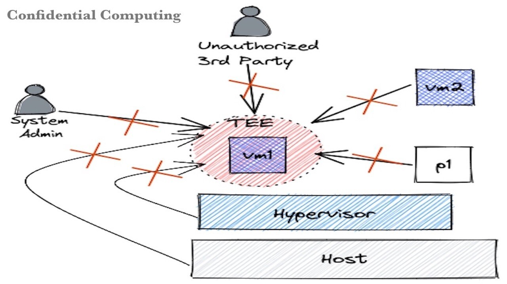
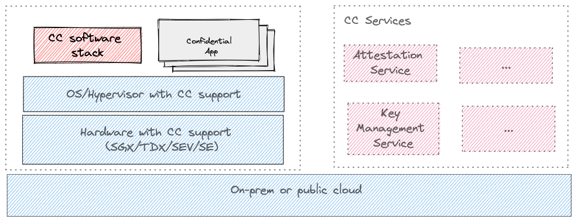

# Awesome Confidential Computing

Collection of materials to help with the understanding of this fascinating technology.

## Big Picture

Confidential computing protects your workload from unauthorised entities — the host or hypervisor, system administrators, service providers, other VMs, and processes on the host.

A Trusted Execution Environment (TEE) is at the heart of a confidential computing solution. TEEs are secure and isolated environments provided by confidential computing (CC) enabled hardware that prevents unauthorised access or modification of applications and data while in use

The following diagram provides a logical view of confidential computing solution. This can be used as a mental model to have a better understanding of the technology.

Source: [Understanding a confidential computing solution](https://bit.ly/cc-solution)

## Overview
* [Confidential Computing Overview and Use cases](https://confidentialcomputing.io/wp-content/uploads/sites/85/2021/03/confidentialcomputing_outreach_whitepaper-8-5x11-1.pdf)
* [Process based and VM based TEEs](https://next.redhat.com/2019/12/02/current-trusted-execution-environment-landscape/)
* [Confidential Computing across Edge-to-Cloud for Machine Learning: A Survey Study](http://arxiv.org/abs/2307.16447)
* [Survey of research on confidential computing (IET 2024)](https://ietresearch.onlinelibrary.wiley.com/doi/full/10.1049/cmu2.12759)
* [Confidential Computing Consortium – White Papers & Reports](https://confidentialcomputing.io/resources/white-papers-reports/)
* [IDC Research: Confidential Computing as Strategic Imperative (2025)](https://confidentialcomputing.io/wp-content/uploads/sites/10/2025/11/US53866125.pdf)

## Hardware with CC support

* [AMD SEV](https://developer.amd.com/sev/)
* [ARM TrustZone](https://www.arm.com/technologies/trustzone-for-cortex-a)
* [ARM Confidential Compute Architecture (CCA)](https://www.arm.com/architecture/security-features/arm-confidential-compute-architecture)
* [IBM Secure Execution](https://www.ibm.com/docs/en/linux-on-systems?topic=linux-components)
* [IBM PEF](https://developer.ibm.com/articles/l-support-protected-computing/)
* [Intel SGX](https://www.intel.in/content/www/in/en/architecture-and-technology/software-guard-extensions.html)
* [Intel TDX](https://www.intel.com/content/www/us/en/developer/articles/technical/intel-trust-domain-extensions.html)
* [NVIDIA H100/H200 Confidential Computing](https://www.nvidia.com/en-us/data-center/solutions/confidential-computing/)
* [RISC-V CoVE (Confidential VM Extension)](https://github.com/riscv-non-isa/riscv-ap-tee)

## Operating System with CC support

* [Linux support - SEV](https://dri.freedesktop.org/docs/drm/virt/kvm/x86/amd-memory-encryption.html)
* [Linux support - SGX](https://dri.freedesktop.org/docs/drm/x86/sgx.html?highlight=sgx)
* [Linux support - TDX](https://dri.freedesktop.org/docs/drm/x86/tdx.html?highlight=tdx)
* [Linux support - PEF](https://dri.freedesktop.org/docs/drm/powerpc/ultravisor.html?highlight=ibm%20secure%20execution)
* [Linux support - ARM CCA](https://docs.kernel.org/arch/arm64/arm-cca.html)

## CC Software Stack (Active and Open source)

* [CNCF Confidential Containers](https://github.com/confidential-containers)
* [Libkrun](https://github.com/containers/libkrun#linux-sev-variant)
* [Apache Teaclave](https://github.com/apache/incubator-teaclave)
* [SCONE](https://sconedocs.github.io)
* [Gramine Library OS](https://github.com/gramineproject/gramine)
* [Ego](https://github.com/edgelesssys/ego)
* [Enarx](https://github.com/enarx/enarx)
* [Keystone Enclave (RISC-V)](https://github.com/keystone-enclave/keystone)
* [Microsoft Confidential Consortium Framework](https://github.com/microsoft/CCF)
* [MarbleRun](https://github.com/edgelesssys/marblerun)
* [Occlum Library OS](https://github.com/occlum/occlum)
* [Openenclave SDK](https://github.com/openenclave/openenclave)
* [Veracruz](https://github.com/veracruz-project/veracruz)

## Attestation

* [Remote ATtestation procedureS (RATS) Architecture – RFC 9334](https://www.rfc-editor.org/rfc/rfc9334.html)
* [Trustee - Remote Attestation Services](https://github.com/confidential-containers/trustee)
* [IETF CoRIM - Concise Reference Integrity Manifest](https://datatracker.ietf.org/doc/draft-ietf-rats-corim/)
* [ARM CCA Attestation Token Specification](https://datatracker.ietf.org/doc/draft-ffm-rats-cca-token/)
* [Intel CoRIM Profile for Remote Attestation](https://datatracker.ietf.org/doc/draft-cds-rats-intel-corim-profile/)
* [Comparing Attestation Process across different silicon vendors](https://systex22.github.io/papers/systex22-final79.pdf)
* [Understanding Attestation Process](https://pradiptabanerjee.medium.com/understanding-attestation-process-in-a-confidential-computing-solution-ef8f876f34eb)
* [Azure attestation service](https://docs.microsoft.com/en-us/azure/attestation/overview)
* [Intel Trust Authority](https://www.intel.com/content/www/us/en/security/trust-authority.html)
* [Veraison - Open source attestation verification (CCC project)](https://github.com/veraison)
* [Keylime - TPM-based remote attestation (CNCF project)](https://github.com/keylime/keylime)

## Confidential AI

* [Tinfoil - Verifiable Secure Enclaves](https://tinfoil.sh/)
* [Private Mode AI](https://www.privatemode.ai/)
* [NVIDIA Confidential Computing for Secure AI](https://developer.nvidia.com/blog/confidential-computing-on-h100-gpus-for-secure-and-trustworthy-ai/)
* [NVIDIA Secure AI Whitepaper (Blackwell & Hopper)](https://docs.nvidia.com/nvidia-secure-ai-with-blackwell-and-hopper-gpus-whitepaper.pdf)
* [Google Confidential Accelerators for AI Workloads](https://cloud.google.com/blog/products/identity-security/how-confidential-accelerators-can-boost-ai-workload-security)
* [Red Hat: AI Inference with Confidential Computing](https://next.redhat.com/2025/10/23/enhancing-ai-inference-security-with-confidential-computing-a-path-to-private-data-inference-with-proprietary-llms/)
* [Red Hat: Confidential Containers with NVIDIA Accelerated Computing](https://www.redhat.com/en/blog/ai-meets-security-poc-run-workloads-confidential-containers-using-nvidia-accelerated-computing)
* [dstack](https://github.com/Dstack-TEE/dstack)

## Security Threats and Vulnerabilities

### Side-Channel Attacks
* [TEE.Fail - DDR5 Memory Bus Attack on Intel SGX/TDX and AMD SEV-SNP (2025)](https://www.bleepingcomputer.com/news/security/teefail-attack-breaks-confidential-computing-on-intel-amd-nvidia-cpus/)
* [BadRAM](https://badram.eu/)
* [Heracles - Chosen Plaintext Attack on AMD SEV-SNP (2025)](https://heracles-attack.github.io/Heracles-CCS2025.pdf)
* [CounterSEVeillance - Performance Counter Attacks on AMD SEV-SNP](https://www.researchgate.net/publication/390109557_CounterSEVeillance_Performance-Counter_Attacks_on_AMD_SEV-SNP)

### Attack Surveys and Analysis
* [A Survey of RISC-V Secure Enclaves and TEE Vulnerabilities (2025)](https://www.mdpi.com/2079-9292/14/21/4171)
* [TEE Security Analysis - Trust Issues in Execution Environments](https://libroot.org/posts/trusted-execution-environments)

## Products and Offerings

* [Azure Confidential Computing Offerings](https://azure.microsoft.com/en-us/solutions/confidential-compute/#products)
* [Google Confidential Computing Offerings](https://cloud.google.com/confidential-computing)
* [IBMCloud Confidential Computing Offerings](https://www.ibm.com/cloud/confidential-computing)
* [AWS Confidential Computing Offerings](https://docs.aws.amazon.com/enclaves/latest/user/nitro-enclave.html)
* [Red Hat Confidential Containers](https://www.redhat.com/en/blog/learn-about-confidential-containers)
* [ISV Offerings](https://www.ventureradar.com/keyword/Confidential%20Computing)

### Market and Adoption Studies
* [CCC / Linux Foundation Study on Confidential Computing Adoption](https://confidentialcomputing.io/resources/white-papers-reports/)
* [IDC Spotlight: Confidential Computing Use Is Growing](https://my.idc.com/getdoc.jsp?containerId=US52508524)

## Academic Papers

* [SCONE: Secure Linux Containers with Intel SGX (OSDI 2016)](https://www.usenix.org/system/files/conference/osdi16/osdi16-arnautov.pdf)
* [Keystone: An Open Framework for Architecting TEEs](https://keystone-enclave.org)
* [CoVE: Confidential Computing on RISC-V Platforms](https://arxiv.org/abs/2304.06167)
* [virtCCA: Virtualized ARM CCA with TrustZone](https://arxiv.org/abs/2306.11011)
* [PORTAL: Fast Device Access with ARM CCA (2025)](https://taesoo.kim/pubs/2025/sang:portal.pdf)
* [GATOR-V: Production-Grade TEE for RISC-V](https://www.researchgate.net/publication/398472509_GATOR-V_Accelerating_the_RISC-V_Confidential_Computing_Ecosystem_with_a_Production-Grade_TEE)
* [NVIDIA GPU Confidential Computing Demystified](https://arxiv.org/html/2507.02770v1)
* [Confidential Computing across Edge-to-Cloud for ML: A Survey](http://arxiv.org/abs/2307.16447)
* [Privacy-Preserving Decentralized AI with Confidential Computing](https://arxiv.org/html/2410.13752v1)
* [Efficient Privacy-Preserving ML with Lightweight TEE (PETS 2024)](https://petsymposium.org/popets/2024/popets-2024-0119.pdf)

## Misc

* [Intel Confidential Computing Zoo](https://github.com/intel/confidential-computing-zoo)
* [Awesome SGX Opensource](https://github.com/Maxul/Awesome-SGX-Open-Source)
* [Awesome SGX](https://github.com/Liaojinghui/awesome-sgx)
* [Confidential Computing Summit](https://www.confidentialcomputingsummit.com/)
* [CCC Glossary Repository](https://github.com/confidential-computing)
